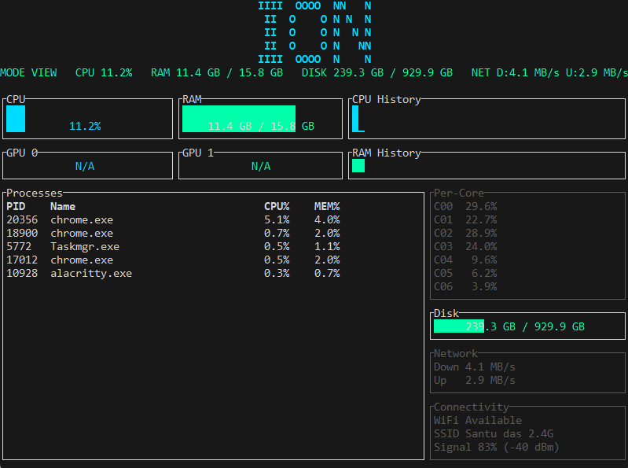

# ION — Terminal System Monitor

## Overview

ION is a high-performance terminal system monitor built for speed, clarity, and smooth motion. It provides real-time system metrics with a futuristic, neon-accented TUI. Linux is the primary target, but functionality extends to macOS and Windows with graceful fallbacks.

## Features

* CPU usage (total and per-core) with live sparklines
* RAM, disk, and network throughput monitoring
* GPU usage detection with safe fallback to N/A for unsupported devices
* Top 5 processes by CPU usage with live navigation and selection highlight
* Rolling CPU and RAM history buffers with spaced sparklines for readability
* WiFi: SSID, signal strength, connection state
* Bluetooth: adapter status, connected devices
* Animated ASCII startup banner with color gradients and subtle TachyonFX effects
* Smooth transitions and subtle animations for all gauges, sparklines, and tables

## Installation

1. Install Rust (stable).
2. Clone the repository.
3. `cargo build --release`
4. Run: `target/release/ion`

## Usage

Run `ion` in your terminal. The interface auto-refreshes every ~200–300ms for up-to-date system metrics.

## Keybindings

* `q` — Quit
* `r` — Refresh immediately
* `/` — Toggle process navigation mode
* `Up`/`Down` or `j`/`k` — Navigate processes in navigation mode

## Architecture

* `src/system.rs` — Collects system and connectivity metrics with OS fallbacks
* `src/app.rs` — Event loop, state management, and async updates
* `src/ui.rs` — Renders all TUI elements using ratatui widgets
* `src/components/` — Contains reusable widgets for gauges, sparklines, tables, and animated banner
